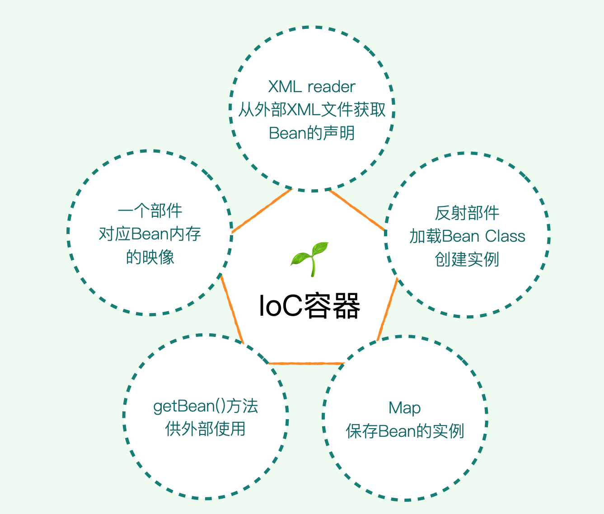
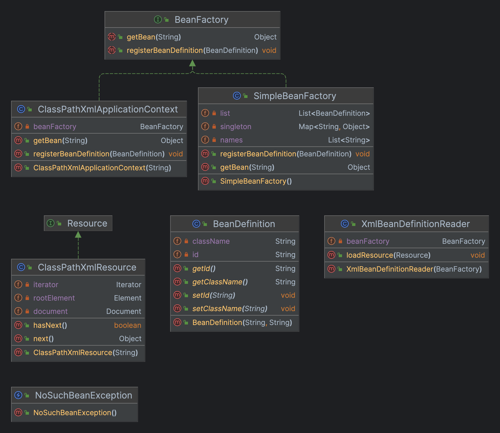
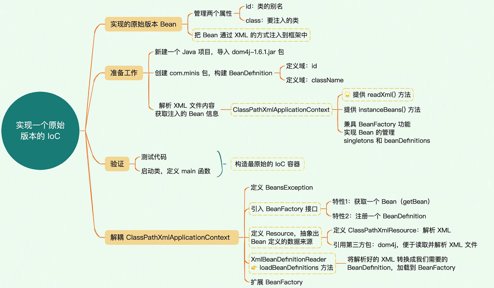
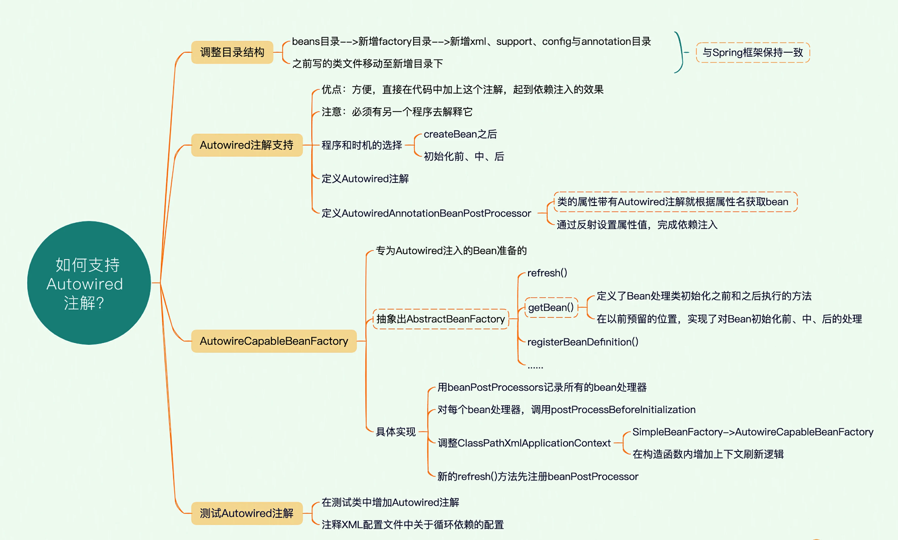

## ioc1

### 小结

## ioc2

我们继续增强 IoC 容器，我们要做的主要有 3 点。

- 增加单例 Bean 的接口定义，然后把所有的 Bean 默认为单例模式。
- 预留事件监听的接口，方便后续进一步解耦代码逻辑。
- 扩展 BeanDefinition，添加一些属性，现在它只有 id 和 class 两个属性，我们要进一步地丰富它。

## ioc3

## ioc4
